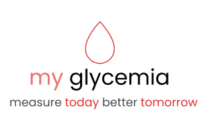

My Glicemia - Front End
=====================

    

This is a React project aimed at collecting glucose information. It provides a user-friendly interface for users to enter their glucose readings and track their blood sugar levels over time. The project utilizes React components and state management to handle data input and rendering.

Features
--------

-   User-friendly interface for entering glucose readings.
-   Validation of input data to ensure accuracy.
-   Display of collected glucose data in a clear and organized manner.
-   Graphical representation of glucose levels over time.

Installation
------------

To run the project locally, follow these steps:

1.  Clone the repository:

bashCopy code

`git clone https://github.com/Teoble/myglicemia-fe`

1.  Navigate to the project directory:

bashCopy code

`cd myglicemia-fe`

1.  Install the dependencies:

bashCopy code

`npm install`

1.  Start the development server:

bashCopy code

`npm start`

1.  Open your browser and visit `http://localhost:3000` to view the application.

Technologies Used
-----------------

-   React
-   React Hooks
-   Vitest
-   Cypress

Contributing
------------

Contributions are welcome! If you would like to contribute to this project, please follow these steps:

1.  Fork the repository.
2.  Create a new branch for your feature or bug fix.
3.  Make your changes and commit them.
4.  Push your changes to your fork.
5.  Submit a pull request.

License
-------

This project is licensed under the MIT License. 

Contact
-------

If you have any questions or suggestions, feel free to contact the project maintainer at <rafael.pereira.sjbv@gmail.com>.